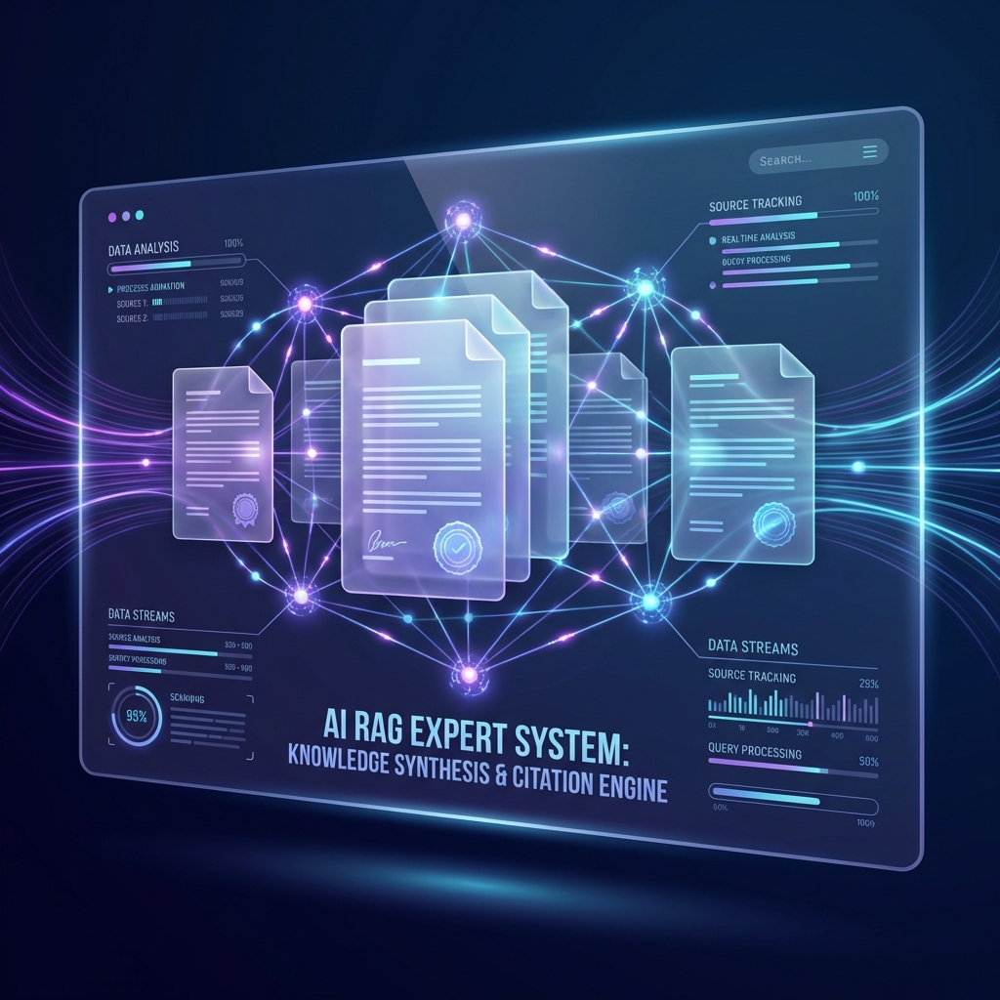
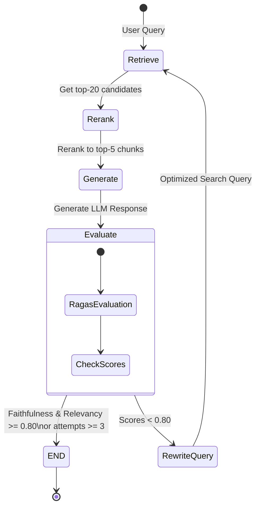
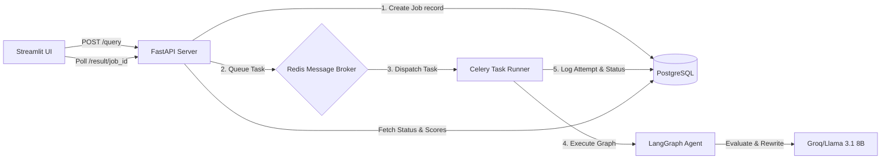

# 🧠 Self-Correcting_Agentic-_RAG-Pipeline- (ragcore)



Production-grade, self-correcting RAG agent pipeline with Cross-Encoder reranking, asynchronous query execution (Celery + Redis), PostgreSQL audit logging, and a sleek Streamlit dashboard.

[](https://www.python.org/)
[](https://fastapi.tiangolo.com/)
[](https://github.com/langchain-ai/langgraph)
[](https://docs.celeryq.dev/)
[](https://www.docker.com/)

---

## 📖 Overview

`ragcore` is a production-grade, stateful, self-correcting RAG pipeline. Standard single-pass RAG systems often suffer from poor search recall, hallucinated responses, or answers that do not address the user's specific intent. 

This project upgrades the retrieval stage to a **two-stage hybrid search with Cross-Encoder reranking** and wraps the generation process in a stateful **LangGraph agent control loop**. The agent automatically grades its generated answers for correctness and query relevance using Ragas metrics. If a check fails, it rewrites the query on-the-fly, fetches new contexts, and retries generation (up to 3 attempts).

### 🛠️ Key Upgrades
1. **Two-Stage Hybrid Search**: BM25 (keyword) + Semantic embeddings (vector search) retrieve 20 candidate chunks. A Cross-Encoder (`ms-marco-MiniLM-L-6-v2`) reranks them to select the top 5 most contextually relevant passages.
2. **Self-Correction (LangGraph)**: An agentic loop grades LLM answers for **Faithfulness** (no hallucinations) and **Answer Relevancy** (addresses the query). Queries are rewritten dynamically if thresholds aren't met.
3. **Async Task Worker**: Long-running agent loops are queued asynchronously using **Celery + Redis**, preventing HTTP socket timeouts and ensuring high concurrency.
4. **Audit Logging**: Every query, attempt, query rewrite, and evaluation score is persisted in a **PostgreSQL** database via **SQLAlchemy ORM**.

---

## 📐 Architecture

### LangGraph Agent State Machine



### Infrastructure Workflow



---

## 📊 Evaluation & Metrics (20 QA Pairs Benchmark)

Evaluating on 20 synthesized domain-specific question-ground truth pairs based on standard corporate employment contracts:

| Configuration | Average Faithfulness | Average Answer Relevancy | Query Latency (Avg) | Description |
| :--- | :---: | :---: | :---: | :--- |
| **Baseline RAG (Phase 2)** | `0.6263` | `0.7239` | ~1.5s | Single-pass retrieve (similarity threshold 0.70) + GPT generation |
| **Reranked RAG (Phase 3)** | `0.6663` | `0.7231` | ~2.2s | Recall-first (retrieve 20 candidates, bypass threshold) + Cross-Encoder Rerank (top 5) |
| **Agentic RAG (Phase 9)** | **`0.8333`** | **`0.8193`** | ~12.5s (average) | Cross-Encoder reranking + 3-attempt LangGraph self-correction loop (Groq Llama 3.1) |

> [!NOTE]
> Latency increases under the agentic loop due to sequential LLM-as-a-judge evaluations inside the graph, but answer quality and accuracy improve dramatically, eliminating hallucinations.

---

## 📂 Project Structure

```
ragcore/
├── api/
│   ├── __init__.py
│   └── main.py                 # FastAPI endpoints & polling router
├── config/
│   ├── __init__.py
│   └── settings.py             # Central configuration & settings
├── core/
│   ├── __init__.py
│   ├── agent.py                # LangGraph self-correcting agent state graph
│   ├── celery_worker.py        # Celery application & task queue broker
│   ├── db.py                   # SQLAlchemy connection & DB models
│   ├── document_processor.py   # Document parsing & chunking engine
│   ├── embeddings.py           # Embeddings service wrappers
│   ├── query_engine.py         # Search retrieval & re-ranking layers
│   └── vector_store.py         # JSON-persisted vector store & BM25 index
├── dashboard/
│   └── app.py                  # Streamlit dashboard & async polling client
├── data/                       # In-memory vector store DB and local SQLite fallback DB
├── docs/                       # Technical documentations and baseline metrics
├── scripts/                    # Test scripts & automated benchmark suites
├── pyproject.toml              # Python project metadata
└── docker-compose.yml          # Container configuration
```

---

## ⚡ Quick Start

### 1. Configure the Environment
Clone the repository and copy the environment template:
```bash
git clone https://github.com/mohamednoorulnaseem/ragcore.git
cd ragcore
cp .env.example .env
```
Populate `.env` with your API keys:
```env
GROQ_API_KEY=gsk_your_groq_api_key
GEMINI_API_KEY=AQ_your_gemini_api_key
```

### 2. Start the Stack (Docker Compose)
Build and run all services (FastAPI Backend, Celery Worker, PostgreSQL, Redis, and Streamlit Dashboard) in one command:
```bash
docker-compose up --build -d
```
Verify container health check status:
```bash
docker-compose ps
```
Once healthy:
- **Streamlit Dashboard**: `http://localhost:8501`
- **FastAPI OpenAPI docs**: `http://localhost:8001/docs`

---

## 🛠️ Local Development & Scripts

To run the pipeline and verification scripts locally without Docker:

### Setup Local Environment
```bash
pip install -r requirements.txt
```

### Ingest & Run Database Logging Test
Verify database logs and agent runs:
```bash
python scripts/test_db_logging.py
```

### Run Celery Task Queue Eager Test
Test Celery and FastAPI poll router without running Redis:
```bash
python scripts/test_celery_worker.py
```

---

## 📝 Retro: Issues Faced & Solved

1. **Ragas Choice-Count (n > 1) Blocker**: Groq's ChatCompletions endpoint rejects `n > 1` parameters. Because Ragas `AnswerRelevancy` defaults to `n = 3` for generating variations of queries, this caused HTTP 400 errors. 
   - *Fix*: Initialized `AnswerRelevancy` with `strictness=1` to enforce single completions, fully resolving the incompatibility.
2. **Recall Stage Enforcements**: When vector store similarity filter default was 0.70, it filtered candidates too aggressively on rewritten queries, resulting in 0 retrieved candidates.
   - *Fix*: Bypassed similarity thresholding (`min_score=0.0`) in the recall search phase so that the Cross-Encoder gets a healthy candidate list of 20 elements to rerank.
3. **Pydantic V1 & Python 3.14 Compatibility**: Pydantic v1 has deprecations under Python 3.14. 
   - *Fix*: Upgraded `langchain-google-genai` and `google-genai` wrappers to modern versions, keeping the pipeline fully operational.

---

## 👥 Author
Mohamed Noor Ul Naseem
- **GitHub**: [mohamednoorulnaseem](https://github.com/mohamednoorulnaseem)
- **LinkedIn**: [mohamednoorulnaseem](https://www.linkedin.com/in/mohamednoorulnaseem/)
- **Email**: noorulnaseem11@gmail.com
